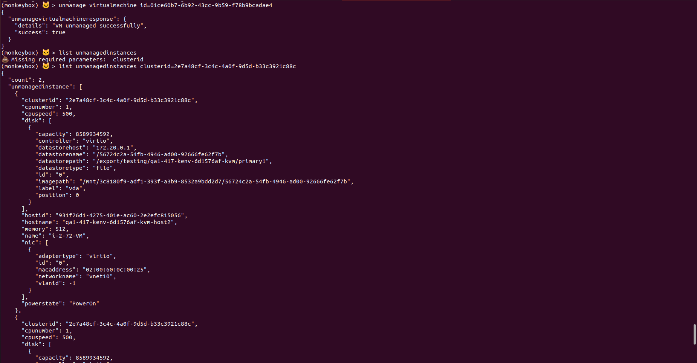
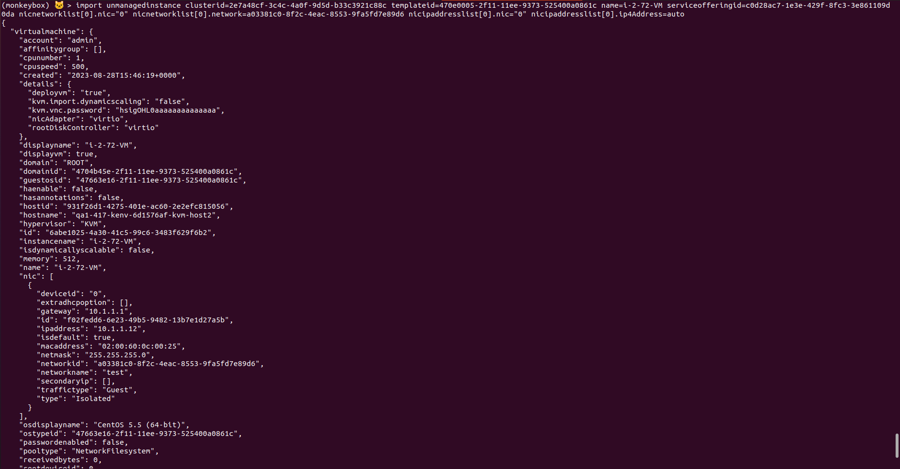
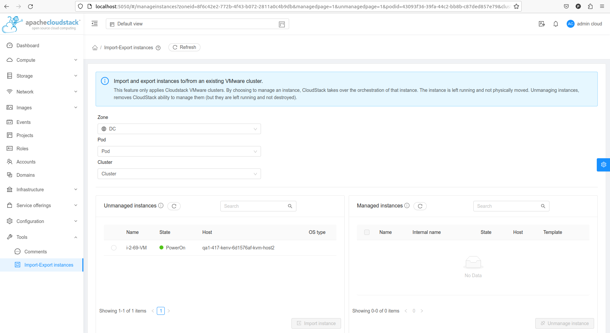
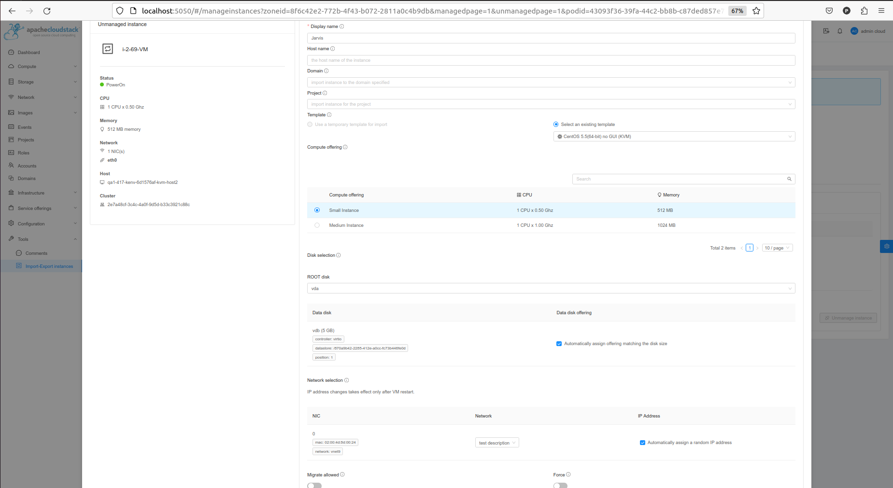
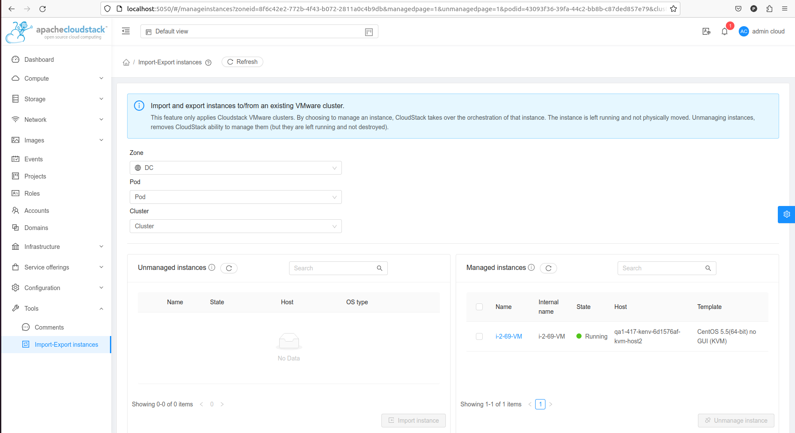
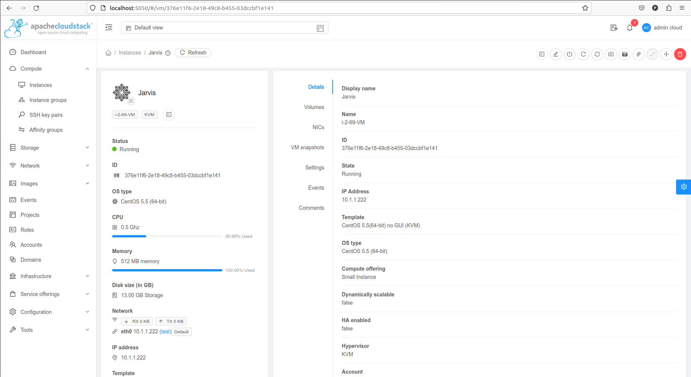

# GSoC2023

 ### Topic: Import-Export Instances on KVM (https://summerofcode.withgoogle.com/programs/2023/projects/f0gpheQM)
 ### Pull request: https://github.com/apache/cloudstack/pull/7712

## Goal of the Project:

The goal of the project is to implement Import and Export Instances(Virtual Machines) functionality for KVM Hypervisor. It allows cloudstack operators to manage or unmanage VMs from their cloud environment. Currently, this functionality is only available for VMWare and we would be working on extending it to KVM Hypervisor. Manage Instance are the ones which are managed by apache cloudstack and persist in cloudstack databases. Unmanage Instances are the ones which are not managed by apache cloudstack and do not persist in cloudstack Database.By  managing through cloudstack, the users get all the benefits that cloudstack as an orchestrator provides.

## Contributions made during GSoC :

### Extension of the Implementation of three API’s:

#### ListUnmanagesInstances
#### unManageVirtualMachine
#### importUnmanagedInstances

listUnmanagedInstances API: This API is used to list all the unmanage instances in apache cloudstack. The purpose of this api is to fetch and list out all the virtual machines that may be running on a hypervisor but are not managed by apache cloudstack. The api also lists the meta data for the virtual machines. Previously it was implemented for VMWare and now as part of this work we extended it for KVM Hypervisor as well. In terms of implementation KVM and VMware are significantly different hypervisors with KVM being open source. Consequently the implementation to support VMWare and KVM are maintained in two separate plugins within apache cloudstack project. 
For extension of this api for KVM ,this api executes the required qemu/virsh commands and presents the users with VM details. It will list all the unmanage instances in the apache cloudstack ( meaning these instances are not managed by cloudstack and do not persist in cloudstack database). To extend  listUnmanagedInstances api for KVM or similar, I created a wrapper class LibvirtPrepareUnmanageVMInstanceCommandWrapper which wraps the core commands (PrepareUnmanageVMInstanceCommand) which is send from management server to  the host/agent. This wrapper class is executed on the host which returns an object of answer class(PrepareUnmanageVMInstanceAnswer) which has the list of all the unmanaged virtual machines which is sent back to the management server and then management server sends it back to the user. This class is used to check if the virtual machine which needs to be unmanaged exists or not.

unmanageVirtualMachine API: It is used to unmanage a managed instance. 
This API cleans up the cloudstack resources dedicated to managing the instance. It takes virtual machine id as parameter and then unmanage it by removing it from the cloudstack database. To implement this api, I tried to populate all the attributes of the UnmanagedInstanceTO class. For this, we created a wrapper class LibvirtGetUnmanagedInstancesCommandWrapper and inside this an unmanaged Instance function which returns an instance of UnmanagedInstanceTO class. Inside this function, we used parseDomainXML() inside LibvirtDomainXMLParser class which will parse the domain xml and will return the attributes of the virtual machine. We wrote the function extractCpuTuneDef() and extractCpuModeDef() which returns the attribute from managed VM xml and parse it and return value such as Shares,Quota,Period which is use to set the VM attributes such as CpuCoresperSocket,cpuSpeed etc.

importUnmanagedInstances API: This API imports an unmanaged Virtual machine into cloudstack from the above list. The management server can populate the details relevant for importing the virtual machine and managing it with the virtual machine’s XML configuration.
To implement it, we populated all the required parameters such as templateid, serviceofferingid, nicnetworklist, nicipaddresslist from unmanageinstanceTO class and the properties which can’t be fetched from TO object would be given by the user during import/managing an unmanaged instance. 
we also made changes in the UI for this API to be able to work/triggered from UI along with CLI.

Below is a screenshot for the API from CLI.

Here we can see the response of unmanageVirtualMachine and listUnmanagedInstances API's.

Below is a screenshot of the response of importUnmanagedInstances API.

## Current State :

We’ve finished the development part and currently my changes are being reviewed by my mentor and other contributors. Based on the feedback/inputs we would be refracting the code and then my changes will  be merged.

## Images for Reference: 

As we can see below we created and unmanaged a VMs and the VM is in unmanaged state and we can see all the unmanaged instances in Unmanaged Instances Section in UI.

These are some mandatory fields which needs to be populated on click of import instance button to import the unmanaged instance

As you can see in the below picture the unmange instance is managed now

We can see the details of the managed instances in the instances section of compute tab

## Future Goals :
Currently there can only be one instance managed or unmanaged at a time. In future,  implementing functionality for managing or unmanaging multiple VMs simultaneously.
Adding more documentation for the feature we implemented.

## Conclusion :
I would like to thank my mentor Nicolas Vazquez and Alexandre Mattioli for their support and help throughout the project. There are also other contributors in the community, such as Daan Hoogland, Rohit Yadav and others, who have also helped me a lot. This summer vacation, I have witnessed the whole process/architecture  of Infrastructure as a Service(IaaS) and how an open source works. Special thanks to the Apache SoftwareFoundation and the GSoC community for such a great opportunity to enter in the open Source realm.

## Work Link Section:

[Github Link of my work/commits  in the Project]
(https://github.com/apache/cloudstack/pull/7712)

[Github Link of the Project]
(https://github.com/apache/cloudstack/issues/7127)
[GSoC Project Link]
(https://summerofcode.withgoogle.com/programs/2023/projects/f0gpheQM)
